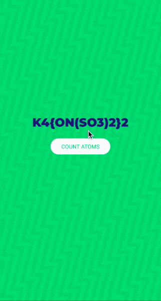

# Molecular Parser
A simple yet aesthetic react native app to calculate the numbers of atoms present in a molecule.

## Built With

* [React Native](https://facebook.github.io/react-native/)
* [Typescript](typescriptlang.org)
* [Jest](https://jestjs.io/)
